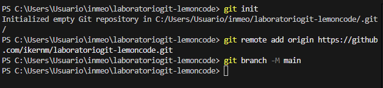
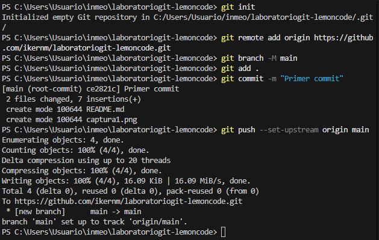

# Laboratorio Git

El primer paso ha sido inicializar Git y conectar el repositorio local con el de GitHub.

Después lo guardamos y subimos los cambios a GitHub. Como es la primera vez que guardamos y subimos el archivo, es necesario introducir el "--set-upstream".

Creamos la rama development y realizamos algunos cambios dentro (añadimos la imagen).

